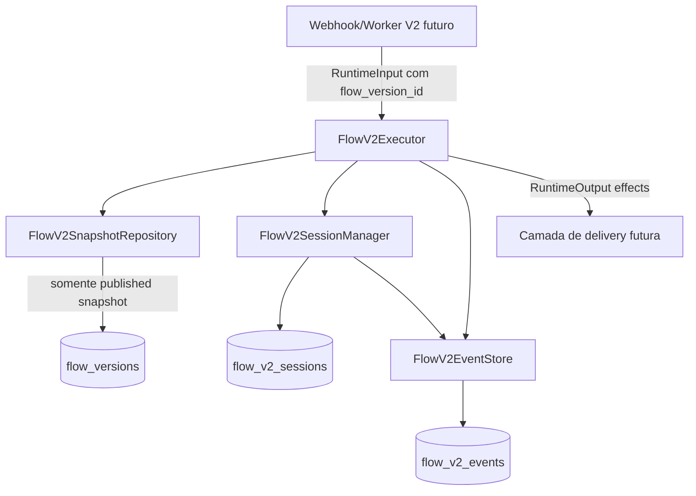
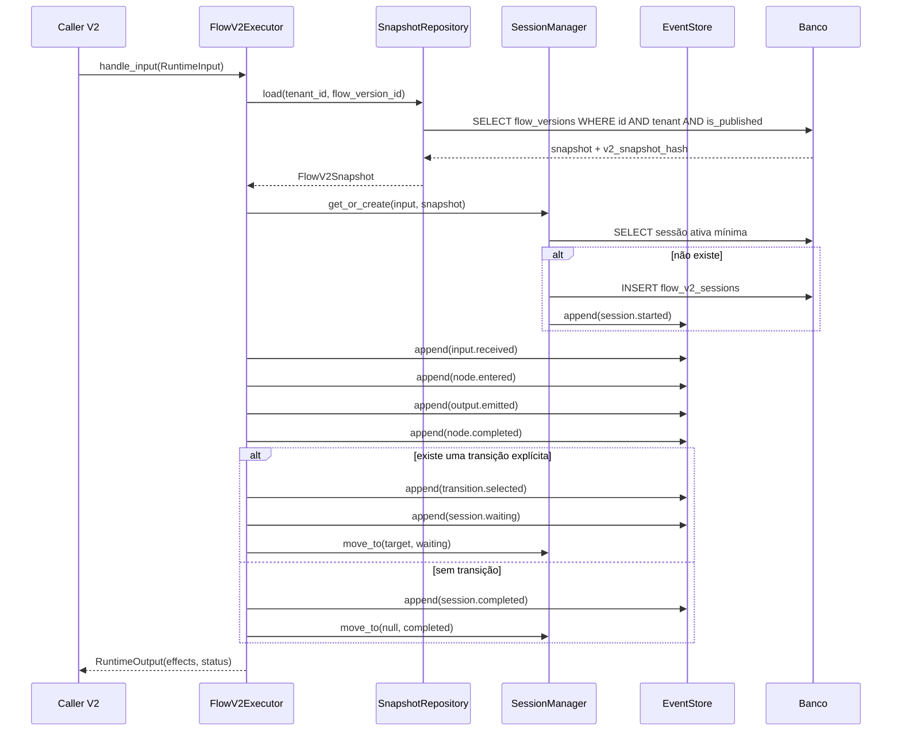
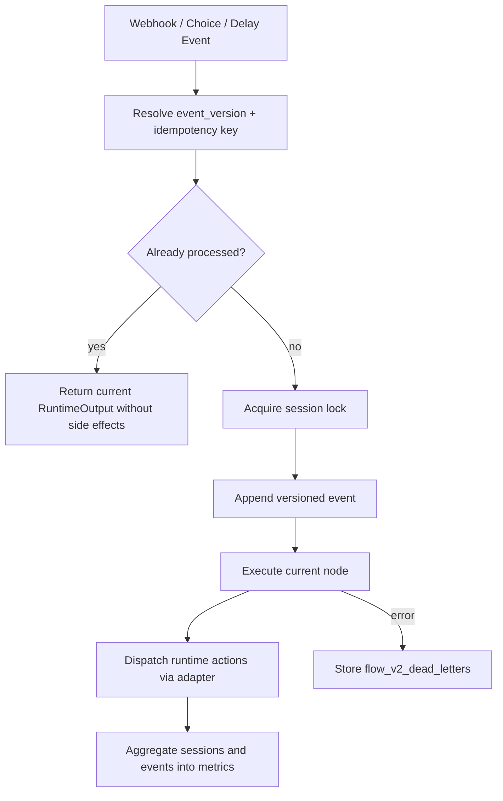

# Wazza Flow Engine Runtime V2 — arquitetura do núcleo

## Objetivo da primeira entrega

Iniciar a reconstrução completa do Flow Engine com um núcleo novo em `backend/app/flow_v2/`, sem corrigir ou reutilizar o Runtime/Flow Engine V1. Esta entrega implementa somente o Runtime V2: executor, snapshot loader, event store, sessão mínima, modelos e migrações. O Builder V2 fica explicitamente fora do escopo.

## Regras inegociáveis

1. **Runtime lê apenas `flow_versions`**: o executor recebe `flow_version_id` publicado e o `FlowV2SnapshotRepository` consulta exclusivamente a tabela `flow_versions` para carregar o snapshot.
2. **Runtime nunca lê drafts**: versões sem `is_published = true` são rejeitadas.
3. **Apenas um executor de fluxo**: `FlowV2Executor` é o único ponto de execução do módulo V2.
4. **Event sourcing obrigatório**: toda entrada, saída, transição, conclusão e falha deve virar evento append-only em `flow_v2_events`.
5. **Snapshot imutável obrigatório**: `flow_versions.v2_snapshot_hash` fixa a versão V2; uma trigger impede alteração posterior de `snapshot`, `v2_snapshot_hash` ou `v2_snapshot_schema_version`.
6. **Sessão mínima**: `flow_v2_sessions` guarda apenas ponteiro atual, status, identidade externa e cursor do stream de eventos.
7. **Sem fallbacks implícitos**: se snapshot, hash, nó inicial ou transição explícita faltarem, o Runtime falha; ele não procura draft, `flows`, `flow_nodes`, `nodes_json` ou V1.
8. **Sem múltiplas fontes de verdade**: o grafo executável é `flow_versions.snapshot`; estado histórico é `flow_v2_events`; o ponteiro operacional é `flow_v2_sessions`.

## Estrutura de pastas

```text
backend/app/flow_v2/
├── ARCHITECTURE.md       # Este documento
├── __init__.py           # API pública mínima do módulo
├── contracts.py          # DTOs e enums do Runtime V2
├── event_store.py        # Escrita/leitura append-only de eventos
├── executor.py           # Único executor do Runtime V2
├── models.py             # Modelos SQLAlchemy V2
├── session_manager.py    # Criação/avanço da sessão mínima
└── snapshot.py           # Loader e validação de snapshot imutável
```

## Componentes

### `FlowV2Executor`

Responsável por orquestrar uma chamada de runtime:

1. Recebe `RuntimeInput` com `tenant_id`, `flow_version_id` e identidade externa.
2. Carrega o snapshot imutável via `FlowV2SnapshotRepository`.
3. Cria ou reutiliza sessão ativa via `FlowV2SessionManager`.
4. Registra `input.received`.
5. Executa o nó atual.
6. Registra efeitos, conclusão do nó, transição e status final.
7. Retorna `RuntimeOutput` com efeitos para a camada de delivery.

O executor não envia WhatsApp, não chama Builder e não resolve flow por draft. Integrações externas devem consumir `effects`.

### `FlowV2SnapshotRepository`

Carrega `flow_versions.snapshot` com filtros por `tenant_id`, `flow_version_id` e `is_published = true`. Ele valida:

- existência do snapshot;
- presença obrigatória de `v2_snapshot_hash`;
- hash canônico SHA-256 do snapshot;
- arrays `nodes` e `edges`;
- `start_node_id` declarado explicitamente no snapshot.

### `FlowV2EventStore`

Implementa o stream append-only. Cada evento recebe `event_index = session.last_event_index + 1`, garantindo ordenação determinística por sessão.

### `FlowV2SessionManager`

Mantém somente estado operacional mínimo:

- `current_node_id`;
- `status`;
- `last_event_index`;
- `tenant_id`, `flow_version_id` e identidade externa.

A reconstrução auditável do fluxo deve usar eventos, não campos mutáveis da sessão.

## Modelo de banco

### `flow_versions` — extensão V2

| Coluna | Tipo | Papel |
|---|---|---|
| `v2_snapshot_hash` | `varchar(64)` | Hash imutável do snapshot V2 canônico |
| `v2_snapshot_schema_version` | `integer` | Versão do contrato de snapshot V2 |

Trigger: `trg_prevent_flow_v2_snapshot_mutation` bloqueia alteração de snapshot V2 depois que `v2_snapshot_hash` foi preenchido.

### `flow_v2_sessions`

| Coluna | Tipo | Papel |
|---|---|---|
| `id` | UUID | Identificador da sessão |
| `tenant_id` | UUID | Tenant obrigatório |
| `flow_version_id` | UUID | Versão publicada executada |
| `contact_id` | UUID nullable | Associação opcional ao CRM |
| `conversation_id` | UUID nullable | Associação opcional à conversa |
| `external_user_id` | varchar(160) | Identidade de entrada, ex.: telefone normalizado |
| `status` | varchar(32) | `running`, `waiting`, `completed`, `failed` |
| `current_node_id` | varchar(128) nullable | Ponteiro mínimo de retomada |
| `last_event_index` | integer | Cursor do stream append-only |
| `started_at` / `updated_at` | datetime | Controle operacional |

Índice único parcial: uma sessão ativa por `(tenant_id, flow_version_id, external_user_id)` quando `status IN ('running', 'waiting')`.

### `flow_v2_events`

| Coluna | Tipo | Papel |
|---|---|---|
| `id` | UUID | Identificador do evento |
| `tenant_id` | UUID | Tenant obrigatório |
| `session_id` | UUID | Stream da sessão |
| `flow_version_id` | UUID | Versão executada |
| `event_index` | integer | Ordem total dentro da sessão |
| `event_type` | varchar(64) | Tipo do evento |
| `node_id` | varchar(128) nullable | Nó relacionado |
| `input_message_id` | varchar(180) nullable | Idempotência de inbound |
| `payload` | jsonb | Dados do evento |
| `created_at` | datetime | Momento append-only |

Constraints: `(session_id, event_index)` único e `(tenant_id, input_message_id, event_type)` único para idempotência quando há mensagem externa.

## Diagrama de componentes



## Diagrama de sequência



## Contrato mínimo do snapshot V2

```json
{
  "schema_version": 1,
  "start_node_id": "start",
  "nodes": [
    {"id": "start", "type": "message", "data": {"text": "Olá"}}
  ],
  "edges": []
}
```

O hash canônico é calculado sobre o objeto acima, com JSON ordenado por chave. Na publicação V2 futura, o Builder deverá gravar o snapshot em `flow_versions.snapshot`, preencher `v2_snapshot_hash` e nunca alterar esse registro.

## Plano de migração V1 → V2

### Fase 0 — Núcleo isolado

- Criar tabelas `flow_v2_sessions` e `flow_v2_events`.
- Adicionar metadados de snapshot V2 em `flow_versions`.
- Não conectar webhooks existentes ao Runtime V2.
- Não reaproveitar `flow_sessions`, `flow_events`, `flow_nodes`, `flow_edges` ou serviços V1.

### Fase 1 — Publicação V2 controlada

- Criar um processo de publicação V2 que transforma o draft atual em um snapshot V2 canônico.
- Gravar exclusivamente em uma nova linha de `flow_versions`.
- Preencher `v2_snapshot_hash` e `v2_snapshot_schema_version`.
- Marcar `is_published = true` somente após validação completa.

### Fase 2 — Shadow runtime

- Para tenants piloto, disparar `FlowV2Executor` em modo shadow a partir do mesmo inbound, sem enviar mensagens reais.
- Comparar efeitos V2 com outputs esperados.
- Auditar `flow_v2_events` para garantir reconstrução determinística.

### Fase 3 — Cutover por versão publicada

- Roteador de entrada passa a enviar tráfego para Runtime V2 somente quando houver `flow_version_id` V2 publicado e validado.
- Nenhum fallback para V1: falhas de snapshot bloqueiam a execução e geram erro operacional explícito.

### Fase 4 — Encerramento V1

- Congelar criação de novas sessões V1.
- Aguardar conclusão/expiração de sessões V1 existentes.
- Manter dados V1 apenas para auditoria até política de retenção.
- Remover endpoints e workers V1 em uma entrega posterior.

## Fora do escopo desta entrega

- Builder V2.
- Editor visual.
- Conversão automática completa dos drafts V1.
- Integração de webhook produtivo.
- Nós avançados com condições, delay, IA, mídia ou ações externas.

## Sprint 6: Production Hardening Flow



Sprint 6 keeps V1, Builder, and real WhatsApp delivery outside the Runtime V2 production-hardening path.
